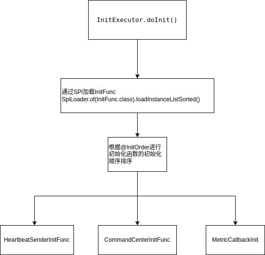

# Sentinel core执行分析

## 简介

提到Sentinel，相信大家都知道联想到熔断、服务间流量控制等。

官网的话总结的很好：
> Sentinel 可以简单的分为 Sentinel 核心库和 Dashboard。
> 
> 我们说的资源，可以是任何东西，服务，服务里的方法，甚至是一段代码。使用 Sentinel 来进行资源保护，主要分为几个步骤:
>1. 定义资源
>2. 定义规则
>3. 检验规则是否生效

想了解Sentinel就绕不开Sph，SphU，SphO，CtSph等。我想有人会好奇这名字代表什么意思，  
官方说了Sph是一个魔法名(magic name)，原来指代信号量Semaphore，历史原因没法改。  
U、O网上传闻代表Unit、Operation。具体留待Eric Zhao, fangjian, mercy哥解释了。

## 初始化

Sentinel初始化会调用`InitExecutor.doInit()`这个方法。进行如下初始化：

1. 通过SPI加载InitFunc（Sentinel SPI类似Spring SPI，有兴趣可看下@SPI注解和SPILoader类）。
2. 排序
3. 调用InitFunc集合的init方法

我们看看这三个核心的InitFunc：
* CommandCenterInitFunc 
* HeartbeatSenderInitFunc
* MetricCallbackInit

### CommandCenter

CommandCenterInitFunc能够初始化CommandCenter。

CommandCenter可以理解为提供服务，我们可以通过这个服务接口和Sentinel core通讯，具体接口由CommandHandler提供。

> The simple command center provides service to exchange information.

围绕CommandCenter有这些工具类：
* @CommandMapping 
* CommandHandler
* CommandHandlerInterceptor

CommandCenter有：
* SimpleHttpCommandCenter 基于java ServerSocket的简单http实现
* NettyHttpCommandCenter  netty实现
* SpringMvcHttpCommandCenter 基于Spring Boot的提供Spring MVC handlerMapping的实现。

简单说下常用的SimpleHttpCommandCenter实现：
1. 启动单线程executor去执行server启动。
2. bizExecutor是处理请求的executor。
3. HttpEventTask读取HTTP报文，解析出CommandRequest，并执行CommandHandler。
4. 返回数据。

### HeartbeatSender

HeartbeatSenderInitFunc通过SPI初始化HeartbeatSender。  
HeartbeatSender是维持Sentinel core和Sentinel dashboard心跳的组件。

~~~
    //通过SPI获取HeartbeatSender
    HeartbeatSender sender = HeartbeatSenderProvider.getHeartbeatSender();
    if (sender == null) {
        RecordLog.warn("[HeartbeatSenderInitFunc] WARN: No HeartbeatSender loaded");
        return;
    }
    //初始化定时任务器
    initSchedulerIfNeeded();
    //获取心跳发送周期 1. 配置 2. 获取不到则用HeartbeatSender的interval
    long interval = retrieveInterval(sender);
    setIntervalIfNotExists(interval);
    //启动心跳任务
    scheduleHeartbeatTask(sender, interval);
~~~

HeartbeatSender的实现有：
* SimpleHttpHeartbeatSender 基于java Socket的http实现
* HttpHeartbeatSender 使用netty http发送心跳
* SpringMvcHttpHeartbeatSender 使用httpclient发送心跳

### MetricCallback

~~~~
    StatisticSlotCallbackRegistry.addEntryCallback(MetricEntryCallback.class.getCanonicalName(),
        new MetricEntryCallback());
    StatisticSlotCallbackRegistry.addExitCallback(MetricExitCallback.class.getCanonicalName(),
        new MetricExitCallback());
~~~~

## 执行

## 总结

以前对Sentinel有一些源码的阅读和理解，不得不感叹看过的东西又再忘记了，这次团队中一位小伙伴需要基于Sentinel开发一个组件，我需要再熟悉下做兜底。
本节主要聚焦于核心执行流程（非异步侧）。

