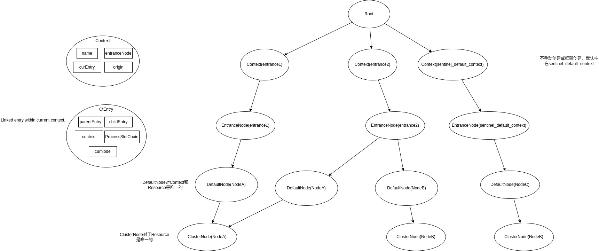
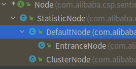
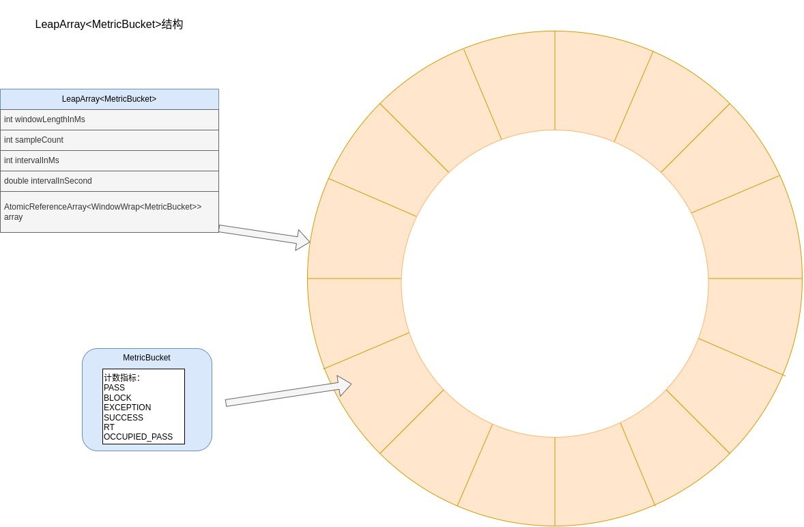

# Sentinel core原理分析

## 简介

提到Sentinel，相信大家都知道联想到熔断、服务间流量控制等。

官网的话总结的很好：
> Sentinel 可以简单的分为 Sentinel 核心库和 Dashboard。
> 
> 我们说的资源，可以是任何东西，服务，服务里的方法，甚至是一段代码。使用 Sentinel 来进行资源保护，主要分为几个步骤:
>1. 定义资源
>2. 定义规则
>3. 检验规则是否生效

想了解Sentinel就绕不开Sph，SphU，SphO，CtSph等。我想有人会好奇这名字代表什么意思，  
官方说了Sph是一个魔法名(magic name)，原来指代信号量Semaphore，历史原因没法改。  
U、O网上传闻代表Unit、Operation。

下面说下初始化和执行流程。

## 初始化

Sentinel初始化会调用`InitExecutor.doInit()`这个方法。进行如下初始化：


1. 通过SPI加载InitFunc（Sentinel SPI类似Spring SPI，有兴趣可看下@SPI注解和SPILoader类）。
2. 排序
3. 调用InitFunc集合的init方法

我们看看这三个核心的InitFunc：
* CommandCenterInitFunc 
* HeartbeatSenderInitFunc
* MetricCallbackInit

### CommandCenter

CommandCenterInitFunc能够初始化CommandCenter。

CommandCenter可以理解为提供服务，我们可以通过这个服务接口和Sentinel core通讯，具体接口由CommandHandler提供。

> The simple command center provides service to exchange information.


围绕CommandCenter有这些工具类：
* @CommandMapping 
* CommandHandler
* CommandHandlerInterceptor

CommandCenter有：
* SimpleHttpCommandCenter 基于java ServerSocket的简单http实现
* NettyHttpCommandCenter  netty实现
* SpringMvcHttpCommandCenter 基于Spring Boot的提供Spring MVC handlerMapping的实现。

简单说下常用的SimpleHttpCommandCenter实现：
1. 启动单线程executor去执行server启动。
2. bizExecutor是处理请求的executor。
3. HttpEventTask读取HTTP报文，解析出CommandRequest，并执行CommandHandler。
4. 返回数据。

### HeartbeatSender


HeartbeatSenderInitFunc通过SPI初始化HeartbeatSender。  
HeartbeatSender是维持Sentinel core和Sentinel dashboard心跳的组件。

~~~
    //通过SPI获取HeartbeatSender
    HeartbeatSender sender = HeartbeatSenderProvider.getHeartbeatSender();
    if (sender == null) {
        RecordLog.warn("[HeartbeatSenderInitFunc] WARN: No HeartbeatSender loaded");
        return;
    }
    //初始化定时任务器
    initSchedulerIfNeeded();
    //获取心跳发送周期 1. 配置 2. 获取不到则用HeartbeatSender的interval
    long interval = retrieveInterval(sender);
    setIntervalIfNotExists(interval);
    //启动心跳任务
    scheduleHeartbeatTask(sender, interval);
~~~

HeartbeatSender的实现有：
* SimpleHttpHeartbeatSender 基于java Socket的http实现
* HttpHeartbeatSender 使用netty http发送心跳
* SpringMvcHttpHeartbeatSender 使用httpclient发送心跳


### MetricCallbackInit


`MetricEntryCallback`和`MetricExitCallback`通过`MetricCallbackInit`初始化。

~~~~
public void init() throws Exception {
    StatisticSlotCallbackRegistry.addEntryCallback(MetricEntryCallback.class.getCanonicalName(),
        new MetricEntryCallback());
    StatisticSlotCallbackRegistry.addExitCallback(MetricExitCallback.class.getCanonicalName(),
        new MetricExitCallback());
}
~~~~

我们可以通过StatisticSlotCallbackRegistry.addEntryCallback和addExitCallback，增加Sentinel规则监控。  
也可通过定义AdvancedMetricExtension接口SPI实现类来做到增加Sentinel规则监控。

## 执行


我们知道Sentinel一般使用`SphU.entry`作为入口。Sentinel core主流程可简单描述为：
1. 定义资源 （目前有两种string资源和Method资源）
2. 定义规则（ProcessorSlot）
3. 检验规则是否生效
>Do all Rules checking about the resource.  
>Each distinct resource will use a ProcessorSlot to do rules checking. Same resource will use same ProcessorSlot globally.


SphU下面会执行如下语句：（Env.sph默认为CtSph。）
````
    //SphU
    Env.sph.entry(name, trafficType, batchCount, args)

    //CtSph
    public Entry entry(String name, EntryType type, int count, Object... args) throws BlockException {
        StringResourceWrapper resource = new StringResourceWrapper(name, type);
        return entry(resource, count, args);
    }
````

我们接下来看下CtSph的核心流程：  

````
    private Entry entryWithPriority(ResourceWrapper resourceWrapper, int count, boolean prioritized, Object... args)
        throws BlockException {
        //1. 获取当前线程的上下文
        Context context = ContextUtil.getContext();
        
        //2. 如果超过了最大context数(2000),直接返回
        if (context instanceof NullContext) {
            // The {@link NullContext} indicates that the amount of context has exceeded the threshold,
            // so here init the entry only. No rule checking will be done.
            return new CtEntry(resourceWrapper, null, context);
        }
        
        //2. 如果是在最上层，初始化context
        if (context == null) {
            // Using default context.
            context = InternalContextUtil.internalEnter(Constants.CONTEXT_DEFAULT_NAME);
        }

        // Global switch is close, no rule checking will do.
        if (!Constants.ON) {
            return new CtEntry(resourceWrapper, null, context);
        }
        
        //3. 获取slot调用链，以资源维度生成chain
        ProcessorSlot<Object> chain = lookProcessChain(resourceWrapper);

        /*
         * Means amount of resources (slot chain) exceeds {@link Constants.MAX_SLOT_CHAIN_SIZE},
         * so no rule checking will be done.
         */
         //4. 如果超过了MAX_SLOT_CHAIN_SIZE(6000)，则不执行rule检查
        if (chain == null) {
            return new CtEntry(resourceWrapper, null, context);
        }
        // 5. 生成entry类（入口）
        Entry e = new CtEntry(resourceWrapper, chain, context);
        try {
            //6. 执行slot链
            chain.entry(context, resourceWrapper, null, count, prioritized, args);
        } catch (BlockException e1) {
            // 规则检查，抛出sentiinel的block异常，调用exit做上下文处理和记录
            e.exit(count, args);
            throw e1;
        } catch (Throwable e1) {
            // This should not happen, unless there are errors existing in Sentinel internal.
            RecordLog.info("Sentinel unexpected exception", e1);
        }
        return e;
    }

````

上面是核心流程，我们**重点分析slot流程和Context的结构**。

### Slot chain

引用官方文档的话，
>在 Sentinel 里面，所有的资源都对应一个资源名称（resourceName），每次资源调用都会创建一个 Entry 对象。
> Entry 可以通过对主流框架的适配自动创建，也可以通过注解的方式或调用 SphU API 显式创建。
> Entry 创建的时候，同时也会创建一系列功能插槽（slot chain）。

slot chain是在上面第三步初始化的`lookProcessChain(resourceWrapper);`。
````
    //CtSph
    ProcessorSlot<Object> lookProcessChain(ResourceWrapper resourceWrapper) {
        ProcessorSlotChain chain = chainMap.get(resourceWrapper);
        if (chain == null) {
            synchronized (LOCK) {
                chain = chainMap.get(resourceWrapper);
                if (chain == null) {
                    // Entry size limit.
                    if (chainMap.size() >= Constants.MAX_SLOT_CHAIN_SIZE) {
                        return null;
                    }

                    chain = SlotChainProvider.newSlotChain();
                    //省略
                }
            }
        }
        return chain;
    }
    
    //SlotChainProvider
    slotChainBuilder = SpiLoader.of(SlotChainBuilder.class).loadFirstInstanceOrDefault();
    
    //DefaultSlotChainBuilder
    List<ProcessorSlot> sortedSlotList = SpiLoader.of(ProcessorSlot.class).loadInstanceListSorted();
````
说说初始化步骤：
1. 通过单例方式初始化resource的ProcessorSlotChain。
2. 通过SPI初始化SlotChainBuilder
3. 通过SPI初始化ProcessorSlot集合


ProcessorSlotChain的结构是一个单向链表，默认的链表元素有（按执行顺序）(部分描述取自wiki)：
1. NodeSelectorSlot 负责收集资源的路径，并将这些资源的调用路径，以树状结构存储起来，用于根据调用路径来限流降级；
2. ClusterBuilderSlot 则用于存储资源的统计信息以及调用者信息，例如该资源的`RT, QPS, thread count`等等，这些信息将用作为多维度限流，降级的依据；
3. LogSlot 打印一些block日志
4. StatisticSlot 用于记录、统计不同纬度的`runtime`指标监控信息；
5. AuthoritySlot 黑白名单控制，以资源名为缓存维度，以origin（app）为控制维度。
6. SystemSlot 用于系统负载限制，可以对总体的应用数据qps、thread、rt达到某阈值做block, 也可以对系统load、cpu用量达到某阈值做block。
7. FlowSlot 限流策略实现，基于阈值类型、流控模式、效果（fail fast、warm up、queue wait）这几个维度去做控制。
8. DegradeSlot 降级策略实现，有基于rt、异常比例、异常次数三种方式降级。

以上slot是执行流程。

数据结构在Context中进行解读。


### Sentinel Context结构

我们先看这段例子代码的：
````
        // 配置规则.
        initFlowRules();

        ContextUtil.enter("entrance1", "appA");
        Entry nodeA = null;
        try {
            nodeA = SphU.entry("nodeA");
        } catch (BlockException e) {
            // 处理被流控的逻辑
            System.out.println("1 blocked!");
        }
        if (nodeA != null) {
            nodeA.exit();
        }
        ContextUtil.exit();

        ContextUtil.enter("entrance2", "appB");
        try {
            nodeA = SphU.entry("nodeB");
        } catch (BlockException e) {
            // 处理被流控的逻辑
            System.out.println("node b blocked!");
        }
        if (nodeA != null) {
            nodeA.exit();
        }
        ContextUtil.exit();

        ContextUtil.enter("entrance2", "appA");
        try {
            nodeA = SphU.entry("nodeA");
        } catch (BlockException e) {
            // 处理被流控的逻辑
            System.out.println("nodeA 2 blocked!");
        }
        if (nodeA != null) {
            nodeA.exit();
        }
        ContextUtil.exit();


        try {
            nodeA = SphU.entry("nodeC");
        } catch (BlockException e) {
            // 处理被流控的逻辑
            System.out.println("nodeC blocked!");
        }
        if (nodeA != null) {
            nodeA.exit();
        }
````

这段代码执行时的整体数据依赖关系：



可看到Context的结构包含了：
* name
* entranceNode
* curEntry
* origin

CtEntry是当前Context中的一个链表结构，指代一个入口，包含：
* 父子entry
* context
* ProcessSlotChain
* curNode


#### StatisticNode和leapArray

按照Sentinel的文档来看，是基于时间窗口，其实现算法是leapArray。

统计的相关数据都用到node我们来看下Node的继承关系：


我们看到顶级父类是StatisticNode里面核心的属性是：`rollingCounterInSecond`和`rollingCounterInMinute`。其实现的数据结构就是LeapArray<MetricBucket>。 （DegradeSlot熔断降级是额外新增了LeapArray去统计）  
LeapArray是基于时间窗口的实现，会把一段时间(intervalInMs)切分为取样个数(sampleCount)。
* int windowLengthInMs 单窗格的毫秒
* int sampleCount 取样个数 `sampleCount = intervalInMs / windowLengthInMs`
* int intervalInMs 间隔时间(ms)
* double intervalInSecond 间隔的时间(s)
* AtomicReferenceArray<WindowWrap<MetricBucket>> array 存储窗格的接口。
* ReentrantLock updateLock 插入和替换窗格的锁

数组里取样位的数据结构是`MetricBucket`，`MetricBucket`存储以下几种类型的计数：
* PASS
* BLOCK 
* EXCEPTION 
* SUCCESS 
* RT `Response Time`。
* OCCUPIED_PASS

结构整理如下：


分析下leapArray的核心方法：
````
    
    // 用 当前时间 根据 窗格时长 计算出当前时间的滑动窗口的 数组下标 
    private int calculateTimeIdx(/*@Valid*/ long timeMillis) {
        long timeId = timeMillis / windowLengthInMs;
        return (int) (timeId % array.length());
    }

    // 用 当前时间 根据 窗格时长 计算出当前滑动窗口的 开始时间 例如：12 - 12%2 = 10
    protected long calculateWindowStart(/*@Valid*/ long timeMillis) {
        return timeMillis - timeMillis % windowLengthInMs;
    }
    
    
    
    public WindowWrap<T> currentWindow(long timeMillis) {
        if (timeMillis < 0) {
            return null;
        }

        //窗口滑动方法 计算窗格下标
        int idx = calculateTimeIdx(timeMillis);
        //窗口滑动方法 计算当前窗格bucket
        long windowStart = calculateWindowStart(timeMillis);


        /*
         * Get bucket item at given time from the array.
         *
         * (1) Bucket is absent, then just create a new bucket and CAS update to circular array.
         * (2) Bucket is up-to-date, then just return the bucket.
         * (3) Bucket is deprecated, then reset current bucket.
         1. bucket不存在，则创建一个新并CAS更新。
         2. bucket是当前最新的，返回。
         3. bucket是过时并应该弃用，加锁并重置当前bucket.
         4. windowStart<窗口开始时间，意味着输入的时间超过了intervalInMs，是错误的输入，理论上不应该输入。
         */
        while (true) {
            WindowWrap<T> old = array.get(idx);
            if (old == null) {
                /*
                 *     B0       B1      B2    NULL      B4
                 * ||_______|_______|_______|_______|_______||___
                 * 200     400     600     800     1000    1200  timestamp
                 *                             ^
                 *                          time=888
                 *            bucket is empty, so create new and update
                 *
                 * If the old bucket is absent, then we create a new bucket at {@code windowStart},
                 * then try to update circular array via a CAS operation. Only one thread can
                 * succeed to update, while other threads yield its time slice.
                 */
                WindowWrap<T> window = new WindowWrap<T>(windowLengthInMs, windowStart, newEmptyBucket(timeMillis));
                if (array.compareAndSet(idx, null, window)) {
                    // Successfully updated, return the created bucket.
                    return window;
                } else {
                    // Contention failed, the thread will yield its time slice to wait for bucket available.
                    Thread.yield();
                }
            } else if (windowStart == old.windowStart()) {
                /*
                 *     B0       B1      B2     B3      B4
                 * ||_______|_______|_______|_______|_______||___
                 * 200     400     600     800     1000    1200  timestamp
                 *                             ^
                 *                          time=888
                 *            startTime of Bucket 3: 800, so it's up-to-date
                 *
                 * If current {@code windowStart} is equal to the start timestamp of old bucket,
                 * that means the time is within the bucket, so directly return the bucket.
                 */
                return old;
            } else if (windowStart > old.windowStart()) {
                /*
                 *   (old)
                 *             B0       B1      B2    NULL      B4
                 * |_______||_______|_______|_______|_______|_______||___
                 * ...    1200     1400    1600    1800    2000    2200  timestamp
                 *                              ^
                 *                           time=1676
                 *          startTime of Bucket 2: 400, deprecated, should be reset
                 *
                 * If the start timestamp of old bucket is behind provided time, that means
                 * the bucket is deprecated. We have to reset the bucket to current {@code windowStart}.
                 * Note that the reset and clean-up operations are hard to be atomic,
                 * so we need a update lock to guarantee the correctness of bucket update.
                 *
                 * The update lock is conditional (tiny scope) and will take effect only when
                 * bucket is deprecated, so in most cases it won't lead to performance loss.
                 */
                if (updateLock.tryLock()) {
                    try {
                        // Successfully get the update lock, now we reset the bucket.
                        return resetWindowTo(old, windowStart);
                    } finally {
                        updateLock.unlock();
                    }
                } else {
                    // Contention failed, the thread will yield its time slice to wait for bucket available.
                    Thread.yield();
                }
            } else if (windowStart < old.windowStart()) {
                // Should not go through here, as the provided time is already behind.
                return new WindowWrap<T>(windowLengthInMs, windowStart, newEmptyBucket(timeMillis));
            }
        }
    }
   
````

## 总结


上图取自sentinel的wiki。

以前对Sentinel有一些源码的阅读和理解，不得不感叹看过的东西又再忘记了，这次让团队中一位小伙伴基于Sentinel开发一个组件，我再捡起来顺便记录下。
本节主要聚焦于初始化和核心执行流程（非异步侧）。对基础数据结构也做了分析。

重点分析了Sentinel core的初始化，ProcessSlotChain执行流程，Context和LeapArray。


