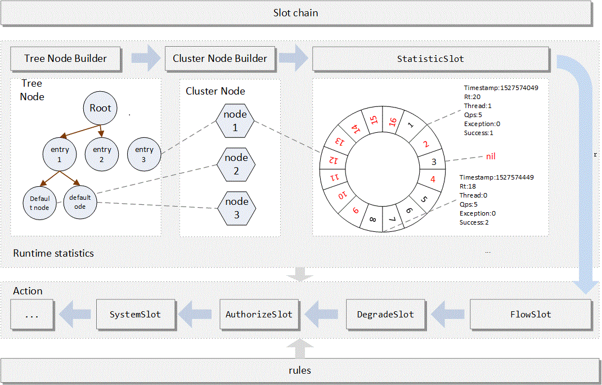

# Sentinel core原理分析

## 简介

提到Sentinel，相信大家都知道联想到熔断、服务间流量控制等。

官网的话总结的很好：
> Sentinel 可以简单的分为 Sentinel 核心库和 Dashboard。
> 
> 我们说的资源，可以是任何东西，服务，服务里的方法，甚至是一段代码。使用 Sentinel 来进行资源保护，主要分为几个步骤:
>1. 定义资源
>2. 定义规则
>3. 检验规则是否生效

想了解Sentinel就绕不开Sph，SphU，SphO，CtSph等。我想有人会好奇这名字代表什么意思，  
官方说了Sph是一个魔法名(magic name)，原来指代信号量Semaphore，历史原因没法改。  
U、O网上传闻代表Unit、Operation。

下面说下初始化和执行流程。

## 初始化

Sentinel初始化会调用`InitExecutor.doInit()`这个方法。进行如下初始化：


1. 通过SPI加载InitFunc（Sentinel SPI类似Spring SPI，有兴趣可看下@SPI注解和SPILoader类）。
2. 排序
3. 调用InitFunc集合的init方法

我们看看这三个核心的InitFunc：
* CommandCenterInitFunc 
* HeartbeatSenderInitFunc
* MetricCallbackInit

### CommandCenter

CommandCenterInitFunc能够初始化CommandCenter。

CommandCenter可以理解为提供服务，我们可以通过这个服务接口和Sentinel core通讯，具体接口由CommandHandler提供。

> The simple command center provides service to exchange information.


围绕CommandCenter有这些工具类：
* @CommandMapping 
* CommandHandler
* CommandHandlerInterceptor

CommandCenter有：
* SimpleHttpCommandCenter 基于java ServerSocket的简单http实现
* NettyHttpCommandCenter  netty实现
* SpringMvcHttpCommandCenter 基于Spring Boot的提供Spring MVC handlerMapping的实现。

简单说下常用的SimpleHttpCommandCenter实现：
1. 启动单线程executor去执行server启动。
2. bizExecutor是处理请求的executor。
3. HttpEventTask读取HTTP报文，解析出CommandRequest，并执行CommandHandler。
4. 返回数据。

### HeartbeatSender


HeartbeatSenderInitFunc通过SPI初始化HeartbeatSender。  
HeartbeatSender是维持Sentinel core和Sentinel dashboard心跳的组件。

~~~
    //通过SPI获取HeartbeatSender
    HeartbeatSender sender = HeartbeatSenderProvider.getHeartbeatSender();
    if (sender == null) {
        RecordLog.warn("[HeartbeatSenderInitFunc] WARN: No HeartbeatSender loaded");
        return;
    }
    //初始化定时任务器
    initSchedulerIfNeeded();
    //获取心跳发送周期 1. 配置 2. 获取不到则用HeartbeatSender的interval
    long interval = retrieveInterval(sender);
    setIntervalIfNotExists(interval);
    //启动心跳任务
    scheduleHeartbeatTask(sender, interval);
~~~

HeartbeatSender的实现有：
* SimpleHttpHeartbeatSender 基于java Socket的http实现
* HttpHeartbeatSender 使用netty http发送心跳
* SpringMvcHttpHeartbeatSender 使用httpclient发送心跳


### MetricCallbackInit


`MetricEntryCallback`和`MetricExitCallback`通过`MetricCallbackInit`初始化。

~~~~
public void init() throws Exception {
    StatisticSlotCallbackRegistry.addEntryCallback(MetricEntryCallback.class.getCanonicalName(),
        new MetricEntryCallback());
    StatisticSlotCallbackRegistry.addExitCallback(MetricExitCallback.class.getCanonicalName(),
        new MetricExitCallback());
}
~~~~

我们可以通过StatisticSlotCallbackRegistry.addEntryCallback和addExitCallback，增加Sentinel规则监控。  
也可通过定义AdvancedMetricExtension接口SPI实现类来做到增加Sentinel规则监控。

## 执行


我们知道Sentinel一般使用`SphU.entry`作为入口。Sentinel core主流程可简单描述为：
1. 定义资源 （目前有两种string资源和Method资源）
2. 定义规则（ProcessorSlot）
3. 检验规则是否生效
>Do all Rules checking about the resource.  
>Each distinct resource will use a ProcessorSlot to do rules checking. Same resource will use same ProcessorSlot globally.


SphU下面会执行如下语句：（Env.sph默认为CtSph。）
````
    //SphU
    Env.sph.entry(name, trafficType, batchCount, args)

    //CtSph
    public Entry entry(String name, EntryType type, int count, Object... args) throws BlockException {
        StringResourceWrapper resource = new StringResourceWrapper(name, type);
        return entry(resource, count, args);
    }
````

我们接下来看下CtSph的核心流程：  

````
    private Entry entryWithPriority(ResourceWrapper resourceWrapper, int count, boolean prioritized, Object... args)
        throws BlockException {
        Context context = ContextUtil.getContext();
        if (context instanceof NullContext) {
            // The {@link NullContext} indicates that the amount of context has exceeded the threshold,
            // so here init the entry only. No rule checking will be done.
            return new CtEntry(resourceWrapper, null, context);
        }

        if (context == null) {
            // Using default context.
            context = InternalContextUtil.internalEnter(Constants.CONTEXT_DEFAULT_NAME);
        }

        // Global switch is close, no rule checking will do.
        if (!Constants.ON) {
            return new CtEntry(resourceWrapper, null, context);
        }

        ProcessorSlot<Object> chain = lookProcessChain(resourceWrapper);

        /*
         * Means amount of resources (slot chain) exceeds {@link Constants.MAX_SLOT_CHAIN_SIZE},
         * so no rule checking will be done.
         */
        if (chain == null) {
            return new CtEntry(resourceWrapper, null, context);
        }

        Entry e = new CtEntry(resourceWrapper, chain, context);
        try {
            chain.entry(context, resourceWrapper, null, count, prioritized, args);
        } catch (BlockException e1) {
            e.exit(count, args);
            throw e1;
        } catch (Throwable e1) {
            // This should not happen, unless there are errors existing in Sentinel internal.
            RecordLog.info("Sentinel unexpected exception", e1);
        }
        return e;
    }

````


## 总结




## 后记

以前对Sentinel有一些源码的阅读和理解，不得不感叹看过的东西又再忘记了，这次团队中一位小伙伴需要基于Sentinel开发一个组件，我需要再熟悉下做兜底。
本节主要聚焦于核心执行流程（非异步侧）。


